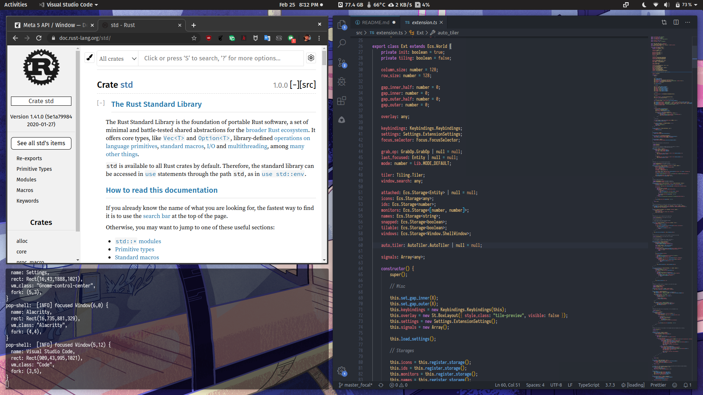

# Pop Shell

Pop Shell is a keyboard-driven layer for GNOME Shell which allows for quick and sensible navigation and management of windows. The core feature of Pop Shell is the addition of advanced tiling window management — a feature that has been highly-sought within our community. For many — ourselves included — i3wm has become the leading competitor to the GNOME desktop.

Tiling window management in GNOME is virtually nonexistent, which makes the desktop awkward to interact with when your needs exceed that of two windows at a given time. Luckily, GNOME Shell is an extensible desktop with the foundations that make it possible to implement a tiling window manager on top of the desktop.

Therefore, we see an opportunity here to advance the usability of the GNOME desktop to better accomodate the needs of our community with Pop Shell. Advanced tiling window management is a must for the desktop, so we've merged i3-like tiling window management with the GNOME desktop for the best of both worlds.

[](https://raw.githubusercontent.com/pop-os/shell/master/screenshot.webp)

---

## Table of Contents

- [The Proposal](#the-proposal): Possible upstreaming into GNOME
- [The Problem](#the-problem): Why we need this in GNOME
- [Installation](#installation): For those wanting to install this on their distribution
- The Solution:
  - [Shared Features](#shared-features): Behaviors shared between stacking and auto-tiling modes
  - [Stacking Mode](#stacking-mode): Behaviors specific to the stacking mode
  - [Auto-Tile Mode](#auto-tile-mode): Behaviors specific to the auto-tiling mode
  - [Plugins](#plugins): Details about plugins and development
- [Developers](#developers): Guide for getting started with development
---

## The Proposal

A proposal for integration of the tiling window management features from Pop Shell into GNOME is currently under development. It will be created as a GitLab issue on GNOME Shell for future discussion, once we have invested our time into producing a functioning prototype, and learned what does and does not work in practice.

Ideally, the features explored in Pop Shell will be available for any environment using Mutter — far extending the half-monitor tiling capability currently present. By starting out as a shell extension, anyone using GNOME Shell can install this onto their system, without having to install a Pop-specific fork of GNOME on their system.

---

## The Problem

So, why is this a problem for us, and why do so many of our users switch to i3wm?

### Displays are large, and windows are many

GNOME currently only supports half-tiling, which tiles one window to one side of the screen, and another window to the other side of the screen. If you have more than two windows, it is expected to place them on separate workspaces, monitors, or to alternate between windows with `Alt` + `Tab`.

This tends to work fine if you only have a small handful of applications. If you need more than two windows at a time on a display, your only option is to manually drag windows into position, and resize them to fit alongside each other — a very time-consuming process that could easily be automated and streamlined.

### Displays are large. Very, **very** large

Suppose you are a lucky — or perhaps unlucky — owner of an ultra-wide display. A maximized window will have much of its preferences and controls dispersed across the far left and far right corners. The application may place a panel with buttons on the far left, while other buttons get shifted to either the distant center, or far right.

Half-tiling in this scenario means that each window will be as large as an entire 2560x1440 or 4K display. In either scenario, at such extreme sizes, the mouse becomes completely useless — and applications become unbearable to use — in practice.

### Fighting the window manager is futile

As you struggle with fighting the window manager, it quickly becomes clear that any attempt to manage windows in a traditional stacking manner — where you need to manually move windows into place, and then manually resize them — is futile. Humans are nowhere near as precise or as quick as algorithms at aligning windows alongside at each other on a display.

### Why not switch to i3wm?

The GNOME desktop comes with many useful desktop integration features, which are lost when switching to an i3wm session. Although possible to connect various GNOME session services to an i3wm session, much of the GNOME desktop experience is still lost in the process. The application overview, the GNOME panel, and GNOME extensions.

Even worse, many users are completely unfamiliar with tiling window managers, and may never feel comfortable switching "cold turkey" to one. By offering tiling window management as feature which can be opted into, we can empower the user to ease into gaining greater control over their desktop, so that the idea of tiling window management suddenly becomes accessible.

There are additionally those who do want the traditional stacking window management experience, but they also want to be able to opt into advanced tiling window management, too. So it should be possible to opt into tiling window management as necessary. Other operating systems have successfully combined tiling window management features with the traditional stacking window management experience, and we feel that we can do this with GNOME as well..

---

## Installation

To install this GNOME Shell extension, you MUST have the following:

- GNOME Shell 3.36
- TypeScript 3.8
- GNU Make

Proper functionality of the shell requires modifying GNOME's default keyboard shortcuts. For a local installation, run `make local-install`.

If you want to uninstall the extension, you may invoke `make uninstall`, and then open the "Keyboard Shortcuts" panel in GNOME Settings to select the "Reset All.." button in the header bar.

> Note that if you are packaging for your Linux distribution, many features in Pop Shell will not work out of the box because they require changes to GNOME's default keyboard shortcuts. A local install is necessary if you aren't packaging your own GNOME session with these default keyboard shortcuts unset or changed.

### Packaging status

- [Fedora](https://src.fedoraproject.org/rpms/gnome-shell-extension-pop-shell/): `sudo dnf install gnome-shell-extension-pop-shell` 
- [Arch Linux](https://aur.archlinux.org/packages/?O=0&K=gnome-shell-extension-pop-shell) (Using Yay as AUR helper): 
    - `yay -S gnome-shell-extension-pop-shell`
    - For precompiled binary version: `yay -S gnome-shell-extension-pop-shell-bin`
    - For GitHub repository version: `yay -S gnome-shell-extension-pop-shell-git`

---

## Shared Features

Features which are shared between stacking and auto-tiling modes.

### Directional Keys

These are key to many of the shortcuts utilized by tiling window managers. This document will henceforth refer to these keys as `<Direction>`, which default to the following keys:

- `Left` or `h`
- `Down` or `j`
- `Up` or `k`
- `Right` or `l`

### Overridden GNOME Shortcuts

- `Super` + `q`: Close window
- `Super` + `m`: Maximize the focused window
- `Super` + `,`: Minimize the focused window
- `Super` + `Esc`: Lock screen
- `Super` + `f`: Files
- `Super` + `e`: Email
- `Super` + `b`: Web Browser
- `Super` + `t`: Terminal

### Window Management Mode

> This mode is activated with `Super` + `Return`.

Window management mode activates additional keyboard control over the size and location of the currently-focused window. The behavior of this mode changes slightly based on whether you are in auto-tile mode, or in the default stacking mode. In the default mode, an overlay is displayed snapped to a grid, which represents a possible future location and size of your focused window. This behavior changes slightly in auto-tiling mode, where resizes are performed immediately, and overlays are only shown when swapping windows.

Activating this enables the following behaviors:

- `<Direction>`
  - In default mode, this will move the displayed overlay around based on a grid
  - In auto-tile mode, this will resize the window
- `Shift` + `<Direction>`
  - In default mode, this will resize the overlay
  - In auto-tile mode, this will do nothing
- `Ctrl` + `<Direction>`
  - Selects a window in the given direction of the overlay
  - When `Return` is pressed, window positions will be swapped
- `Shift` + `Ctrl` + `<Direction>`
  - In auto-tile mode, this resizes in the opposite direction
- `O`: Toggles between horizontal and vertical tiling in auto-tile mode
- `~`: Toggles between floating and tiling in auto-tile mode
- `Return`: Applies the changes that have been requested
- `Esc`: Cancels any changes that were requested

### Window Focus Switching

When not in window management mode, pressing `Super` + `<Direction>` will shift window focus to a window in the given direction. This is calculated based on the distance between the center of the side of the focused window that the window is being shifted from, and the opposite side of windows surrounding it.

Switching focus to the left will calculate from the center of the east side of the focused window, to the center of the west side of all other windows. The window with the least distance is the window we pick.

### Launcher

The launcher is summoned with `Super` + `/`. The search list displays matching windows based on their window name and title, and applications on the system which can be launched. The arrow keys are used to select an application or window from the search list. If it is a window, the selected window will be visually highlighted with an overlay, in the event that two windows have the same name and title. Pressing `Return` on a window will bring that window to focus, switching to its workspace, and unminimizing it if it was minimized.

#### Launcher Modes

By default, the launcher searches windows and applications. However, you can designate a special launch mode using one of the supported prefixes:

- `:`: Execute a command in `sh`
- `run` | `t:`: Execute a command in `sh` in a terminal
- `=`: Calculator mode, powered by [MathJS](https://mathjs.org/)
- `/` | `~`: Navigate and open directories and files in the file system
- `d:`: Search recent documents

### Inner and Outer Gaps

Gaps improve the aesthetics of tiled windows, and make it easier to grab the edge of a specific window. We've decided to add support for inner and outer gaps, and made these settings configurable in the extension's popup menu.

### Hiding Window Title Bars

Windows with server-side decorations may have their title bars completely hidden, resulting in additional screen real estate for your applications, and a visually cleaner environment. This feature can be toggled in the extension's popup menu. Windows can be moved with the mouse by holding `Super` when clicking and dragging a window to another location. Windows may be closed by pressing GNOME's default `Super` + (`grave` / `~`) shortcut.

---

## Stacking Mode

This is the default mode of Pop Shell, which combines traditional stacking window management, with optional tiling window management features.

### Display Grid

In this mode, displays are split into a grid of columns and rows. When entering tile mode, windows are snapped to this grid as they are placed. The number of rows and columns are configurable in the extension's popup menu in the panel.

### Snap-to-Grid

An optional feature to improve your tiling experience is the ability to snap windows to the grid when using your mouse to move and resize them. This provides the same precision as entering window management mode to position a window with your keyboard, but with the convenience and familiarity of a mouse. This feature can be enabled through the extension's popup menu.

---

## Auto-Tile Mode

This provides the tiling window manager experience, where windows are automatically tiled across the screen as they are created. This feature is disabled by default, but can be enabled through the extension's popup menu in the panel. When enabled, windows that were launched before enabling it will not be associated with any tree. Dragging and dropping them will begin to tile them in a tree.

### Keyboard Shortcuts

- `Super` + `O`
  - Toggles the orientation of a fork's tiling orientation
- `Super` + `G`
  - Toggles a window between floating and tiling. 
  - See [#customizing the window float list](#customizing-the-floating-window-list)

### Feature Overview

- If no windows are on a display, a newly-opened window will start out maximized on the display
- As new windows are opened, they are tiled into the currently-focused window
- Windows can be detached and retached to different areas of the tree by dragging and dropping them
- The default tiling orientation is based on the dimensions of the window being attached to
- The tiling orientation of the fork associated with the focused window can be altered with `Super` + `O`.
- The division of space between branches in a fork can be altered by resizing windows
  - Window resizes can be carried out with the mouse
  - Tiling mode may also be used to adjust sizes with the keyboard
- Ultra-wide displays are treated as two separate displays by default (**Unimplemented**)

### Customizing the Floating Window List
There is file `$XDG_CONFIG_HOME/pop-shell/config.json` where you can add the following structure:
```
{
  class: "<WM_CLASS String from xprop>",
  title: "<Optional Window Title>"
}
```
For example, doing `xprop` on GNOME Settings (or GNOME Control Center), the WM_CLASS values are `gnome-control-center` and `Gnome-control-center`. Use the second value (Gnome-control-center), which pop-shell will read. `title` is optional.

After applying changes in the `config.json`, you can reload the tiling if it doesnt work the first time.

## Plugins

### Launcher Plugins

Pop Shell supports extending the functionality of its launcher, and comes with some plugins by default. System plugins are stored in `/usr/lib/pop-shell/launcher/`, while user plugins are stored in `$HOME/.local/share/pop-shell/launcher/`. Some plugins are included by default:

- [calc](src/plugins/calc)
- [files](src/plugins/files)
- [pulse](src/plugins/pulse)
- [recent](src/plugins/recent)
- [terminal](src/plugins/terminal)
- [web](src/plugins/web)
- [scripts](src/plugin_scripts.ts)

> Plugin developers, see [the API documentation for the launcher API](src/plugins/README.md).

### Scripts Plugin

This builtin plugin displays scripts in search results. Included with Pop Shell is a set of scripts for log out, reboot, and power off. Scripts are stored in `/usr/lib/pop-shell/scripts/` and `$HOME/.local/share/pop-shell/scripts/`. [See the included scripts as an example of how to create our own](src/scripts/).

## Developers

Due to the risky nature of plain JavaScript, this GNOME Shell extension is written in [TypeScript](https://www.typescriptlang.org/). In addition to supplying static type-checking and self-documenting classes and interfaces, it allows us to write modern JavaScript syntax whilst supporting generation of code for older targets.

Please install the following as dependencies when developing:

- [`Node.js`](https://nodejs.org/en/) LTS+ (v12+)
- Latest `npm` (comes with NodeJS)
- `npm install typescript@latest`

While working on the shell, you can recompile, reconfigure, reinstall, and restart GNOME Shell with logging with `make debug`. Note that this only works reliably in X11 sessions, since Wayland will exit to the login screen on restarting the shell.

[Discussions welcome on Pop Chat](https://chat.pop-os.org/community/channels/dev)

## GNOME JS
GNOME JS is a little different from standard JS, so the included `Makefile` runs `sed` on the transpiled JavaScript to convert the small number of differences between JS and GJS. Notably, GJS only partially supports ES2015, and has its own module system which works differently from what ES2015 expects. The sed scripts will replace `import` and `export` statements with the expected GNOME variants.

```js
const Me = imports.misc.extensionUtils.getCurrentExtension();
```

## License

Licensed under the GNU General Public License, Version 3.0, ([LICENSE](LICENSE) or https://www.gnu.org/licenses/gpl-3.0.en.html)

### Contribution

Any contribution intentionally submitted for inclusion in the work by you, shall be licensed under the GNU GPLv3.
